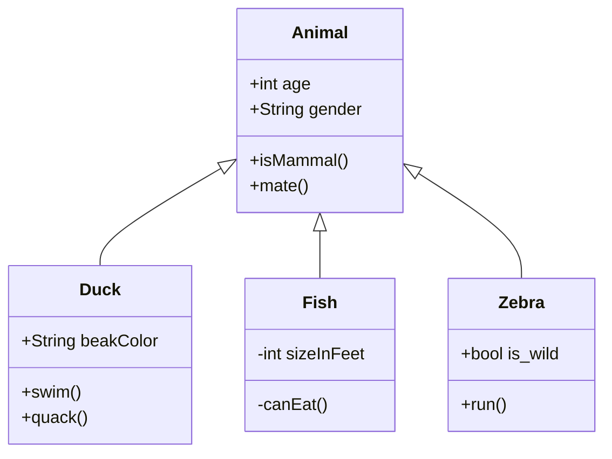

# Título 1

## Título 2

### Título 3

#### Título 4

##### Título 5

###### Título 6

- essa é
- uma lista
- não numerada
  1.  esta é
  2. uma lista
  3. numerada

-------------------------------------------------------------

link interessante: [computation biology](https://ngotelli.github.io/Bio381Vids/)

boa piada!

> 

---

|	BLOCK Quote ausente :(

Aqui vai um código: `mean(x = )`

Código simples:

```R
"Hello world!"
```

```R
anuran <- read.data("my_data.txt", header = TRUE)
```

está é a notação matemática para média (centralizado):  
$$
\displaystyle\sum_{i}^{n} {\frac{x_i}{n}}
$$
está é a notação matemática para média (alinhado???): `$\displaystyle\sum_{i}^{n} {\frac{x_i}{n}}$`


------------------------

| Coluna 1   | Coluna 2   | Coluna 3   |
| ---------- | ---------- | ---------- |
| Linha 1\|1 | Linha 1\|2 | Linha 1\|3 |

~~~gfm

~~~


